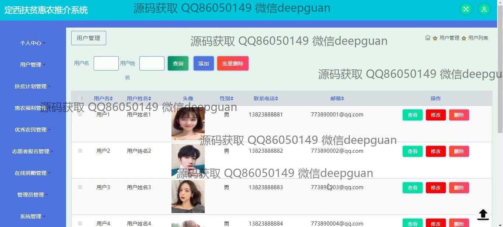

<h1 align="center">的定西扶贫惠农推介志愿者系统</h1>

## 简介
定西扶贫惠农推介志愿者系统：角色分为管理员、用户；提供扶贫计划管理、惠农福利管理、优秀农民展示、志愿者信息登记及在线捐赠等功能。    --计算机毕业设计源码；毕设源码；java毕业设计源码

## 联系方式

<h3 align="center">获取完整代码与数据库文件 + 微信：deepguan QQ: 86050149 QQ群: 783742310</h3>

<h3 align="center">可帮忙远程部署 包运行成功！提供远程部署、修改代码、设计文档指导、代码讲解等服务！</h3>

## 功能介绍（完整见运行截图）
管理员： 主要功能包括用户管理、扶贫计划管理、惠农福利管理、优秀农民管理、志愿者报名管理和在线捐赠管理。管理员可以登录系统，在网站首页通过导航栏访问各个模块。可以查看和管理用户信息，审核和编辑扶贫计划、惠农福利及优秀农民信息，管理志愿者的报名意愿及在线捐赠记录。还可以上传系统内容如轮播图、管理论坛、发布公告和扶贫计划等信息。用户： 用户的基本功能包括注册、登录以及访问退出系统。注册时需填写个人信息如用户名、密码、联系方式和邮箱。登录后，用户可以通过导航栏访问首页、扶贫计划、惠农福利和论坛等模块。用户可以在个人中心查看和更新个人信息，进行志愿者报名或捐赠活动，浏览和参与论坛讨论以及查看扶贫和惠农政策、优质农民信息等。在合适情况下，用户还可以发布和管理个人内容。

## 运行截图

本代码来源于网络,仅供学习参考使用!

